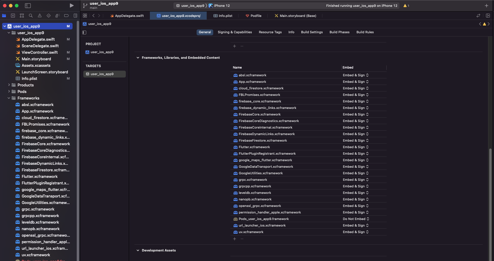
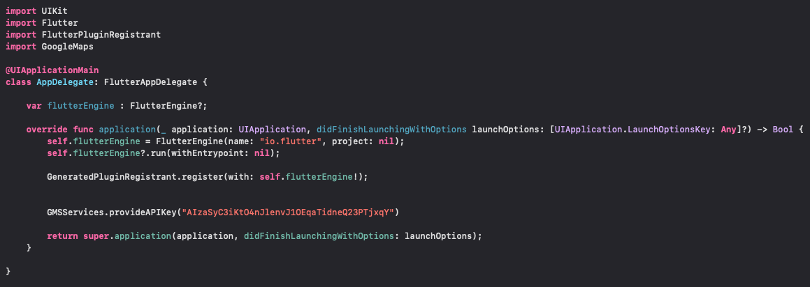
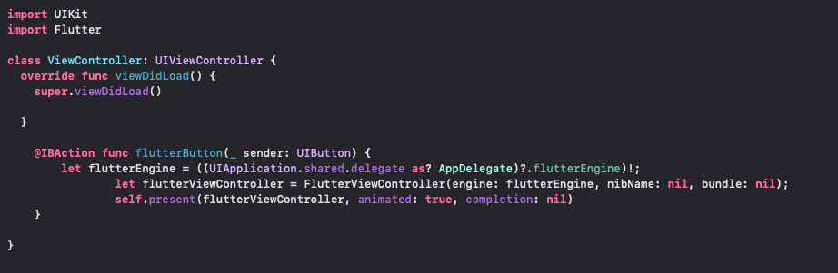

# Add-to-App Flutter

- เป็น Feature หนึ่งของ Flutter ที่ช่วยให้เราสามารถนำ Application ของเราที่สร้างจาก Flutter เข้าไป Integrate ใน App ทางฝั่ง Native ( Android , IOS ) ได้ โดยจะแบ่งการ Setup เป็น 2 แบบคือ Android และ IOS ดังนี้

# Overview

- Project นี้จะมีการ test ในเรื่องของ Permission (Camera,Location) , Firebase (Dynamic Link) , Sending data from Flutter to Native app (Method Channel)

# Add-to-App Flutter Process

1. สร้าง flutter module ขึ้นมาจากคำสั่ง 
   
   ```bash
   flutter create -t module --org com.example my_flutter
   ```

2. นำ Source code ของ Application เราไปใส่ใน Flutter module
3. Setup project ตามขั้นตอนดังนี้

## Project Setup for Android

1. ในฝั่ง Android จะมีวิธีการ Integrate อยู่ 2 แบบคือ AAR file และ the module’s source code ในที่นี้จะพูดถึงตัว AAR file
2. เมื่อเรา Setup ตัว Flutter module เสร็จเรียบร้อย เราสามารถทำการ Build AAR file ใน terminal ได้โดยตรงจากคำสั่ง

    ```bash
    flutter build aar
    ```

3. จากนั้นเมื่อเราได้ AAR file มาแล้วก็ทำการ include path ของ AAR file ที่ Build ได้เข้าไปใน Android App
   
   ```bash
    android {
        # ...
    }

    repositories {
        maven {
            url 'some/path/my_flutter/build/host/outputs/repo'
            # path ของ AAR file ที่เราได้ Build ขึ้นมา
        }
        maven {
            url 'https://storage.googleapis.com/download.flutter.io'
            # ดึง Flutter SDK มาใช้งาน
        }
    }

    dependencies {
        // ...
        debugImplementation 'com.example.flutter_module:flutter_debug:1.0'
        profileImplementation 'com.example.flutter_module:flutter_profile:1.0'
        releaseImplementation 'com.example.flutter_module:flutter_release:1.0'
    }
   ```
4. เพิ่ม Flutter Activity ในไฟล์ AndroidManifest.xml เพื่อให้สามารถเปิด Flutter ภายใน Android App ได้

    ```bash
     <activity
         android:name="io.flutter.embedding.android.FlutterActivity"
         android:theme="@style/LaunchTheme"
         android:configChanges="orientation|keyboardHidden|keyboard|screenSize|locale|layoutDirection|fontScale|screenLayout|density|uiMode"
         android:hardwareAccelerated="true"
         android:windowSoftInputMode="adjustResize"
     />
    ```

5. Run Flutter Activity

    ```bash
     startActivity(
     FlutterActivity.createDefaultIntent(currentActivity)
     );
    ```

## Project Setup for IOS

1. ในฝั่ง IOS จะแบ่งได้ 3 วิธีคือ Embed with CocoaPods and the Flutter SDK , Embed frameworks in Xcode , Embed application and plugin frameworks in Xcode and Flutter framework with CocoaPods ในที่นี้จะพูดถึงวิธีที่ 2
2. เมื่อเรา Setup ตัว Flutter module เสร็จเรียบร้อย เราสามารถทำการ Build IOS Framework ใน terminal ได้โดยตรงจากคำสั่ง 

    ```bash
    flutter build ios-framework --output=some/path/MyApp/Flutter/
    ```

3. เข้าไปที่ Tab General ใน Project ฝั่ง host แล้วเพิ่ม Framework ทั้งหมดที่สร้างขึ้นมาเข้าไปในหัวข้อ Frameworks , Libraries , and Embeded Content
   

4. Setup Flutter Engine , FlutteViewController , และ Plugins ต่างๆในไฟล์ AppDelegate และ ViewController
   
   

# ** ในการ build เป็น AAR และ IOS Framework จะใช้ flutter channel แตกต่างกัน โดย AAR ใช้ flutter channel master ส่วน IOS Framework ใช้ flutter channel stable
